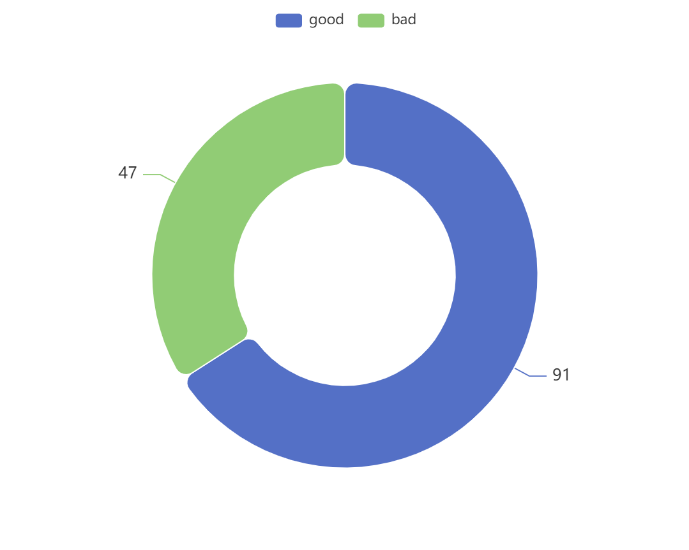

# pybars
Apache ECharts + python magic 


# install
!git clone https://github.com/DrPenknife/pybars.git

# how to use
```
import sqlite3
import pybars.charts as charts

con = sqlite3.connect("example.db")
charts.bindSql(con)
```

In Jupyter use annotation to turn a query into a graph
```
%%sql show=graph type=bar itemBorderRadius=10 stack=yes width=600 height=480 fontSize=13
with stats(cat,rating,votes) as (
    select 1, "bad",  ABS(RANDOM() % 70) + 30
    union all
    select 1, "good", ABS(RANDOM() % 70) + 30
    union all 
    select cat+1, rating, ABS(RANDOM() % 70) + 30 from stats limit 10
)
select "Category_" || cat as x, rating as color, votes as y from stats
order by 1 desc
```

</img>


```
%%sql show=graph type=pie itemBorderRadius=10 stack=yes width=600 height=480 fontSize=14
with stats(cat,rating,votes) as (
    select 1, "bad",  ABS(RANDOM() % 70) + 30
    union all
    select 1, "good", ABS(RANDOM() % 70) + 30
)
select rating as x , "color",  votes as y from stats
order by 1 desc
```

</img>

